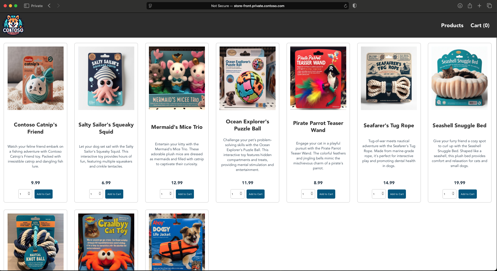
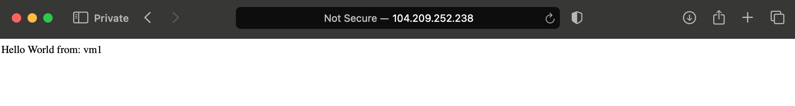
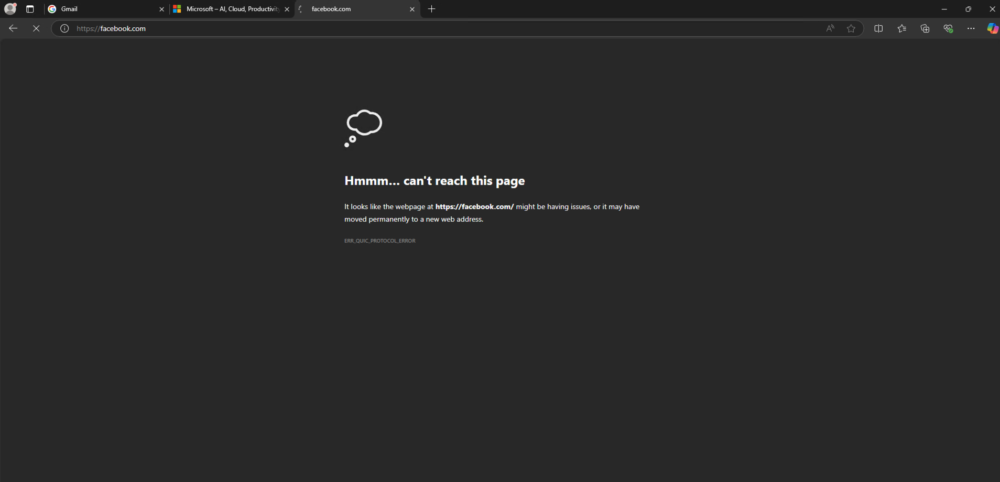

## Project Purpose
Replicate hub and spoke architecture with azure firewall DNAT ingress to internal load balancer -> virtual machine web servers and Azure Kubernetes Cluster; egress from VMs and AKS to azure firewall using user defined routes and forced tunneling.

## Getting Started
1. Clone the repository
2. Update `subscription_id` and `admin_password` in `main.auto.tfvars`
3. Install make using `sudo apt install make` or `brew install make`
4. Run `make init` to initialize terraform
5. Run `make validate` to validate the terraform configuration
5. Run `make plan` to see the changes
6. Run `make apply` to apply the changes
7. AKS configuration:
  - Since AKS is a private cluster, you will need to access the management plane from the jumpbox
  - Clone this repository to the jumpbox
  - Authenticate to the AKS cluster using the portal instructions
  - Apply the charts in the `charts` directory
  - Get the external IP of the ingress controller and update the DNAT rule -> translated IP

## Test FW Rules for AKS
1. Modify host file to point to the public IP of the Azure firewall
```
40.84.2.121	store-front.private.contoso.com 
```


## Test FW Rules for VMs (currently not working due to AKS changes)
1. Browse to the public IP of the Azure firewall and you should see the html markup returned from virtual machines behind the internal load balancer
- ingress flow: (internet) -> (Azure Firewall) -[DNAT]-> (Internal Load Balancer) -> Virtual Machines
- egress flow: (Virtual Machines) -[UDR]-> (Azure Firewall) -[SNAT]-> Internet


2. RDP to the virtual machines by using the public IP of the Azure firewall

3. Attempt to browse to *.google.com and *.microsoft.com (should work). All other traffic is blocked by firewall application rules.




## TODO
- [ ] translated ip address for internal load balancer -> virtual machines works but not for AKS since AKS ILB is created by AKS and not terraform; setting manually for now
- [ ] modify DNAT rule to both AKS ILB and VM ILB


