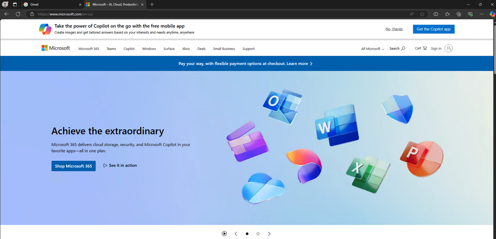

## Project Purpose
Replicate hub and spoke architecture with azure firewall DNAT ingress to internal load balancer -> virtual machine web servers and Azure Kubernetes Cluster; egress from VMs and AKS to azure firewall using user defined routes and forced tunneling.

## Getting Started
1. Clone the repository
2. Update `subscription_id` and `admin_password` in `main.auto.tfvars`
3. Install make using `sudo apt install make` or `brew install make`
4. Run `make init` to initialize terraform
5. Run `make validate` to validate the terraform configuration
5. Run `make plan` to see the changes
6. Run `make apply` to apply the changes

## Testing
1. Browse to the public IP of the Azure firewall and you should see the html markup returned from virtual machines behind the internal load balancer
- ingress flow: (internet) -> (Azure Firewall) -[DNAT]-> (Internal Load Balancer) -> Virtual Machines
- egress flow: (Virtual Machines) -[UDR]-> (Azure Firewall) -[SNAT]-> Internet

2. RDP to the virtual machines by using the public IP of the Azure firewall

3. Attempt to browse to *.google.com and *.microsoft.com (should work). All other traffic is blocked by firewall application rules.

